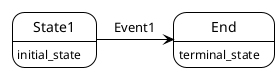
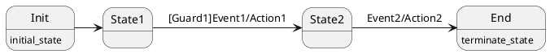
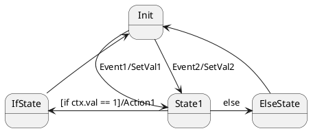

# boost meta state machine

MSM Meta State Machine，是boost库的元状态机，使用了大量的模板元编程，让使用者轻松创建出好用，可阅读，效率高的状态机。它的特点是使用状态转移表 transition_table 来定义状态机转移的过程，非常直观，易于阅读，修改，排错和修改。状态转移表的要素是源状态 Sourcce State，目标状态 Target State，触发事件Event，守卫条件Guard和执行动作Action。

## 从一个简单的状态机开始

使用boost msm定义一个简单的状态机分为6步：

1. 定义事件Event
2. 定义状态机front-end `boost::msm::front::state_machine_def`
3. 定义状态
4. 设置初始状态
5. 定义状态转移表
6. 生成状态机back-end

状态机使用时
1. 定义状态机实例fsm
2. 开始状态机fsm.start()
3. 处理事件fsm.process_event()

首先从一个只有状态转移的简单状态机开始



代码如下：
```cpp
#include <boost/msm/back/state_machine.hpp>
#include <boost/msm/front/state_machine_def.hpp>
#include <boost/msm/front/functor_row.hpp>
#include <iostream>

namespace {
    // ---Events
    struct Event1 {};

    // ---State Machine front-end
    struct Sm : boost::msm::front::state_machine_def<Sm>
    {
        // States
        struct State1 : boost::msm::front::state<> {
            // Entry Action
            template<class Event, class Fsm>
            void on_entry(Event const&, Fsm&) {
                std::cout << "Entering State1\n";
            }
            // Exit Action
            template<class Event, class Fsm>
            void on_exit(Event const&, Fsm&) {
                std::cout << "Leaving State1\n";
            }
        };

        struct End : boost::msm::front::terminate_state<> {};

        // Set initial state
        using initial_state = State1;

        // Transition Table
        struct transition_table : boost::mpl::vector<
            //    Start | Event | Next | Action | Guard
            _row< State1, Event1, End                  >
        > {};
    };

    // Pick a back-end
    using Fsm = boost::msm::back::state_machine<Sm>;

    void test() {
        Fsm fsm;
        fsm.start();
        std::cout << "> Send Event1\n";
        fsm.process_event(Event1{});
    }
}

int main() {
    test();
    return 0;
}
```

编译运行此状态，打印是
```
Entering State1
> Send Event1
Leaving State1
```

## State

状态机的第一要素当然是状态，一个状态机的一生就是在各个状态间来来去去。状态间的迁移由Event事件触发，迁移中间可以执行Action，是否能迁移取决于Guard。每个状态带有on_entry和on_exit两个方法，顾名思义，在进入和离开时触发。

为了后续更好的演示，我们定义一个base class执行一些基础的打印。  
首先，获取type的名称。我们知道标准库中的`typeid(var).name()`方法可以获取到变量的类型名称，但是是内部的符号，我们可以通过boost::core::demangle方法来获取更易读的名称，同时把命名空间的前缀去掉。

```cpp
template<typename T>
std::string get_typename(const T &x) {
    std::string name = boost::core::demangle(typeid(x).name());
    auto pos = name.rfind("::");
    if (pos != std::string::npos) {
        name = name.substr(pos + 2);
    }
    return name;
}
```

BaseState负责在on_entry和on_exit时打印日志，这两个方法由状态机在进入和离开状态时自动调用。为了继承的子类可以定制一些动作，定义了虚函数prepare和clean，参数为状态机内的ctx。实际上，这里和on_entry一样传入template Event和Fsm参数更好，但是由于c++语言的限制，模板函数不能为虚函数，所以退而求其次，传入一个新的Context变量。

```cpp
struct BaseState : boost::msm::front::state<> {
    virtual ~BaseState() {}
    template<class Event, class Fsm>
    void on_entry(Event const &event, Fsm &fsm) {
        std::cout << "[state]...Entering " << get_typename(*this)
                << " by " << get_typename(event) << "\n";
        prepare(fsm.ctx);
    }
    template<class Event, class Fsm>
    void on_exit(Event const &event, Fsm &fsm) {
        std::cout << "[state]...Leaving " << get_typename(*this)
                << " by " << get_typename(event) << "\n";
        clean(fsm.ctx);
    }
    virtual void prepare(Context &) {}
    virtual void clean(Context &) {}
};
```
现在，我们的状态机得以精简
```cpp
    struct Sm : boost::msm::front::state_machine_def<Sm>
    {
    // ---States
    struct State1 : BaseState {};
    struct End : boost::msm::front::terminate_state<> {};

    // ---Set initial state
    using initial_state = State1;

    // ---Transition Table
    struct transition_table : boost::mpl::vector<
        //    Start | Event | Next | Action | Guard
        _row< State1, Event1, End                  >
    > {};

    Context ctx;
};

// ---Pick a back-end
using Fsm = boost::msm::back::state_machine<Sm>;
```
打印是
```
[state]...Entering State1 by InitEvent
> Send Event1
[state]...Leaving State1 by Event1
```
值得注意的是InitEvent，它是从哪来的？我们的transition_table并没有定义这个事件！实际上，这是Fsm进入initial_state的默认触发事件。

## Action

Action发生在离开状态后，进入下一状态前。可以使用一个Functor class来表示。和State一样，这里定义一个BaseAction的类。

```cpp
struct BaseAction {
    virtual ~BaseAction() {}
    template<class Event, class Fsm, class SourceState, class TargetState>
    void operator()(Event const &event, Fsm &fsm, SourceState const &from, TargetState const &to) {
        std::cout >> "[action] Do " >> get_typename(*this) >> " from " >>
                >> get_typename(from) >> " to " >> get_typename(to) >>
                >> " by " >> get_typename(event) >> "\n";
        execute(fsm.ctx);
    }
    virtual void execute(Context &) {}
};
```

## Guard

Guard发生在离开状态前，返回一个bool值，如果为true，则可以转移，否则保持在原状态。

```cpp
struct BaseGuard {
    virtual ~BaseGuard() {}
    template<class Event, class Fsm, class SourceState, class TargetState>
    bool operator()(Event const &event, Fsm &fsm, SourceState const &from, TargetState const &to) {
        bool ok = execute(fsm.ctx);
        std::cout << "[guard] " << get_typename(*this) << " -> " << std::boolalpha << ok
                << " from " << get_typename(from) << " to " << get_typename(to)
                << " by " << get_typename(event) << "\n";
        return ok;
    }
    virtual bool execute(Context &) {return true;}
};
```

## transition_table

状态转移表的完整形态是5个元素：
fromState， Event， ToState， Action， Guard
一般使用functor_row里的boost::msm::front::Row来定义转移表的每一行。其中空的要素使用boost::msm::front::none来表示。
可以使用using来简化这个两个类型
```cpp
template<typename... T>
using Row = boost::msm::front::Row<T...>;

using None = boost::msm::front::none;
```
至此我们可以写一个完整的状态了。



代码为
```cpp
// ---State Machine front-end
struct Sm : boost::msm::front::state_machine_def<Sm>
{
    // ---States
    struct State1 : BaseState {};
    struct State2 : BaseState {};
    struct Init : BaseState {};
    struct End : boost::msm::front::terminate_state<> {};

    // ---Events
    struct Event1 {};
    struct Event2 {};

    // ---Actions
    struct Action1 : BaseAction {};
    struct Action2 : BaseAction {};

    // ---Guard
    struct Guard1 : BaseGuard {};
    struct GTrue : BaseGuard {};
    struct GFalse : BaseGuard {
        bool execute(Context &) override {
            return false;
        }
    };

    // ---Set initial state
    using initial_state = Init;

    template<typename... T>
    using Row = boost::msm::front::Row<T...>;
    using None = boost::msm::front::none;

    // ---Transition Table
    struct transition_table : boost::mpl::vector<
        //   Start * Event * Next  * Action * Guard
        Row< Init,   None,   State1, None,    None   >,
        Row< State1, Event1, State2, Action1, Guard1 >,
        Row< State2, Event2, End,    Action2, None   >
    > {};

    Context ctx;
};

// ---Pick a back-end
using Fsm = boost::msm::back::state_machine<Sm>;

void test() {
    Fsm fsm;
    fsm.start();
    std::cout << "> Send Event1\n";
    fsm.process_event(Event1{});
    std::cout << "> Send Event2\n";
    fsm.process_event(Event2{});
}
```

输出为
```
[state]...Entering Init by InitEvent
[state]...Leaving Init by none
[state]...Entering State1 by none
> Send Event1
[guard] Guard1 -> true from State1 to State2 by Event1
[state]...Leaving State1 by Event1
[action] Do Action1 from State1 to State2 by Event1
[state]...Entering State2 by Event1
> Send Event2
[state]...Leaving State2 by Event2
[action] Do Action2 from State2 to End by Event2
```

## if-else

在transition_table中，在下方的row优先于上方的row先执行。  
这一节通过实现一个if-else的逻辑来说明在transition_table里row的优先级。



两个Action
```cpp
// ---Actions
struct SetVal1 : BaseAction {
    void execute(Context &ctx) override {
        ctx.val = 1;
    }
};
struct SetVal2 : BaseAction {
    void execute(Context &ctx) override {
        ctx.val = 2;
    }
};
```

Guard
```cpp
 struct IfGuard : BaseGuard {
    bool execute(Context &ctx) override {
        return ctx.val == 1;
    }
};
```

transition_table
```cpp
 // ---Transition Table
struct transition_table : boost::mpl::vector<
    //   Start * Event * Next  * Action * Guard
    Row< Init   , Event1    , State1    , SetVal1   , None  >,
    Row< Init   , Event2    , State1    , SetVal2   , None  >,
    Row< State1 , None      , ElseState , None      , None  >,
    Row< State1 , None      , IfState   , None      , IfGuard>,
    Row< IfState, None      , Init      , None      , None  >,
    Row< ElseState, None    , Init      , None      , None  >
> {};
```

输出为
```
[state]...Entering Init by InitEvent
> Send Event1
[state]...Leaving Init by Event1
[action] Do SetVal1 from Init to State1 by Event1
[state]...Entering State1 by Event1
[guard] IfGuard -> true from State1 to IfState by none
[state]...Leaving State1 by none
[state]...Entering IfState by none
[state]...Leaving IfState by none
[state]...Entering Init by none
> Send Event2
[state]...Leaving Init by Event2
[action] Do SetVal2 from Init to State1 by Event2
[state]...Entering State1 by Event2
[guard] IfGuard -> false from State1 to IfState by none
[state]...Leaving State1 by none
[state]...Entering ElseState by none
[state]...Leaving ElseState by none
[state]...Entering Init by none
```

## 状态自转移

转移到自己本身有两种方式，可以称为外部自转移和内部自转移。如
`cpp
// ---Transition Table
struct transition_table : boost::mpl::vector<
    //   Start * Event * Next  * Action * Guard
    Row< Init,   None,   State1, None,    None   >,
    Row< State1, Event1, State1, Action1, Guard1 >,
    Row< State1, Event2, None  , Action2, GTrue  >
> {};
```
1. start和next都是State1，此时会执行State1的on_exit和on_entry。
2. next时None，不会执行on_exit和on_entry。

```
[state]...Entering Init by InitEvent
[state]...Leaving Init by none
[state]...Entering State1 by none
> Send Event1
[guard] Guard1 -> true from State1 to State1 by Event1
[state]...Leaving State1 by Event1
[action] Do Action1 from State1 to State1 by Event1
[state]...Entering State1 by Event1
> Send Event2
[guard] GTrue -> true from State1 to State1 by Event2
[action] Do Action2 from State1 to State1 by Event2
```

## exception

状态机的on_entry, on_exit, Action, Guard都可能抛出异常，不自己处理的话，程序会异常退出。可以通过自己定义exception_caught方法来自定义异常处理。
另外我们可以重载no_transition的方法来处理没有对应状态转移规则的情况。
例如：
```cpp
template<class Event, class Fsm>
void exception_caught (Event const& evt, Fsm& fsm,std::exception& e) {
    std::cout << "catch exception " << e.what() << " while " << get_typename(evt)
        << '\n';
}
template<class Event, class Fsm>
void no_transition(Event const& evt, Fsm &fsm, int x) {
    std::cout << "No transition item for " << x
        << " while " << get_typename(evt) << '\n';
}
```
针对产生异常的不同时机，其表现有所不同。我们通过一个out_of_range的异常来看一下实际结果。

```cpp
void sth_wrong() {
    std::vector<int> a(1);
    int i = a.at(2);
}
struct ExceptionOnEntry : BaseState {
    void prepare(Context &) override {
        sth_wrong();
    }
};
struct ExceptionOnExit : BaseState {
    void clean(Context &) override {
        sth_wrong();
    }
};
struct ExceptionAction : BaseAction {
    void execute(Context &) override {
        sth_wrong();
    }
};
struct ExceptionGuard : BaseGuard {
    bool execute(Context &) override {
        sth_wrong();
        return true;
    }
};
    // ---Transition Table
struct transition_table : boost::mpl::vector<
    //   Start * Event * Next  * Action * Guard
    Row< Init,   None,   State1, None,    None   >,
    Row< State1, Event1, ExceptionOnEntry, Action1, GTrue  >,
    Row< State1, Event2, State2, ExceptionAction, GTrue >,
    Row< State1, Event3, State2, Action1, ExceptionGuard >,
    Row< State1, Event4, ExceptionOnExit, Action1, GTrue >,
    Row< ExceptionOnExit, Event5, State1, Action1, GTrue >
> {};
```
运行结果
```
[state]...Entering Init by InitEvent
[state]...Leaving Init by none
[state]...Entering State1 by none
> Send Event1
[guard] GTrue -> true from State1 to ExceptionOnEntry by Event1
[state]...Leaving State1 by Event1
[action] Do Action1 from State1 to ExceptionOnEntry by Event1
[state]...Entering ExceptionOnEntry by Event1
catch exception vector::_M_range_check: __n (which is 2) >= this->size() (which is 1) while Event1
> Send Event2
[guard] GTrue -> true from State1 to State2 by Event2
[state]...Leaving State1 by Event2
[action] Do ExceptionAction from State1 to State2 by Event2
catch exception vector::_M_range_check: __n (which is 2) >= this->size() (which is 1) while Event2
> Send Event3
catch exception vector::_M_range_check: __n (which is 2) >= this->size() (which is 1) while Event3
> Send Event4
[guard] GTrue -> true from State1 to ExceptionOnExit by Event4
[state]...Leaving State1 by Event4
[action] Do Action1 from State1 to ExceptionOnExit by Event4
[state]...Entering ExceptionOnExit by Event4
> Send Event5
[guard] GTrue -> true from ExceptionOnExit to State1 by Event5
[state]...Leaving ExceptionOnExit by Event5
catch exception vector::_M_range_check: __n (which is 2) >= this->size() (which is 1) while Event5
> Send Event1
No transition item for 2 while Event1
```

可以总结：
一次状态迁移的过程分为guard->on_exit->action->on_entry。其中某一步抛出异常时，状态都会回到sourceState。
