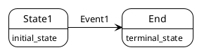

# boost meta state machine

MSM Meta State Machine，是boost库的元状态机，使用了大量的模板元编程，让使用者轻松创建出好用，可阅读，效率高的状态机。它的特点是使用状态转移表 transition_table 来定义状态机转移的过程，非常直观，易于阅读，修改，排错和修改。状态转移表的要素是源状态 Sourcce State，目标状态 Target State，触发事件Event，守卫条件Guard和执行动作Action。

## 从一个简单的状态机开始

使用boost msm定义一个简单的状态机分为6步：

1. 定义事件Event
2. 定义状态机front-end `boost::msm::front::state_machine_def`
3. 定义状态
4. 设置初始状态
5. 定义状态转移表
6. 生成状态机back-end

状态机使用时
1. 定义状态机实例fsm
2. 开始状态机fsm.start()
3. 处理事件fsm.process_event()

首先从一个只有状态转移的简单状态机开始



代码如下：
```cpp
#include <boost/msm/back/state_machine.hpp>
#include <boost/msm/front/state_machine_def.hpp>
#include <boost/msm/front/functor_row.hpp>
#include <iostream>

namespace {
    // ---Events
    struct Event1 {};

    // ---State Machine front-end
    struct Sm : boost::msm::front::state_machine_def<Sm>
    {
        // States
        struct State1 : boost::msm::front::state<> {
            // Entry Action
            template<class Event, class Fsm>
            void on_entry(Event const&, Fsm&) {
                std::cout << "Entering State1\n";
            }
            // Exit Action
            template<class Event, class Fsm>
            void on_exit(Event const&, Fsm&) {
                std::cout << "Leaving State1\n";
            }
        };

        struct End : boost::msm::front::terminate_state<> {};

        // Set initial state
        using initial_state = State1;

        // Transition Table
        struct transition_table : boost::mpl::vector<
            //    Start | Event | Next | Action | Guard
            _row< State1, Event1, End                  >
        > {};
    };

    // Pick a back-end
    using Fsm = boost::msm::back::state_machine<Sm>;

    void test() {
        Fsm fsm;
        fsm.start();
        std::cout << "> Send Event1\n";
        fsm.process_event(Event1{});
    }
}

int main() {
    test();
    return 0;
}
```

编译运行此状态，打印是
```
Entering State1
> Send Event1
Leaving State1
```

## general

为了后续更好的演示，我们定义一些base class执行一些基础的打印。  
首先，获取type的名称。我们知道标准库中的`typeid(var).name()`方法可以获取到变量的类型名称，但是是内部的符号，我们可以通过boost::core::demangle方法来获取更易读的名称，同时把命名空间的前缀去掉。

```cpp
template<typename T>
std::string get_typename(const T &x) {
    std::string name = boost::core::demangle(typeid(x).name());
    auto pos = name.rfind("::");
    if (pos != std::string::npos) {
        name = name.substr(pos + 2);
    }
    return name;
}
```

BaseState负责在on_entry和on_exit时打印日志，这两个方法由状态机在进入和离开状态时自动调用。为了继承的子类可以定制一些动作，定义了虚函数prepare和clean，参数为状态机内的ctx。实际上，这里和on_entry一样传入template Event和Fsm参数更好，但是由于c++语言的限制，模板函数不能为虚函数，所以退而求其次，传入一个新的Context变量。

```cpp
struct BaseState : boost::msm::front::state<> {
    virtual ~BaseState() {}
    template<class Event, class Fsm>
    void on_entry(Event const &event, Fsm &fsm) {
        std::cout << "...Entering " << get_typename(*this)
                << " by " << get_typename(event) << "\n";
        prepare(fsm.ctx);
    }
    template<class Event, class Fsm>
    void on_exit(Event const &event, Fsm &fsm) {
        std::cout << "...Leaving " << get_typename(*this)
                << " by " << get_typename(event) << "\n";
        clean(fsm.ctx);
    }
    virtual void prepare(Context &) {}
    virtual void clean(Context &) {}
};
```

## Action

## Guard

## transition_table

## if-else

## exception